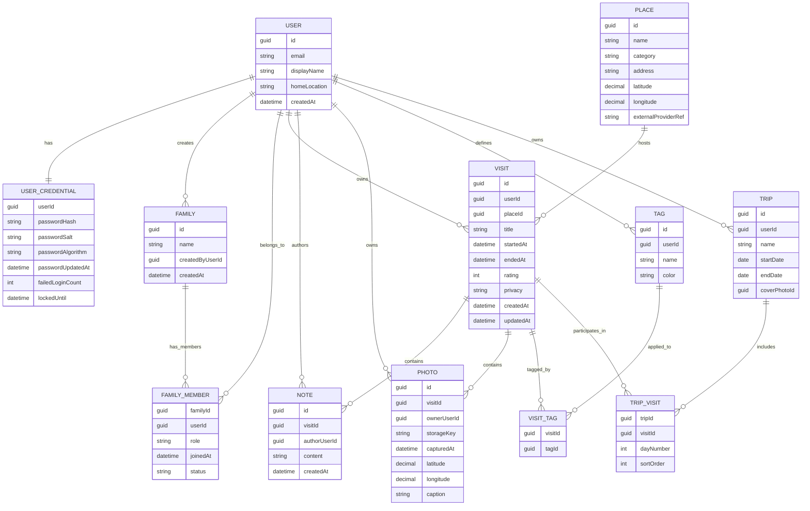
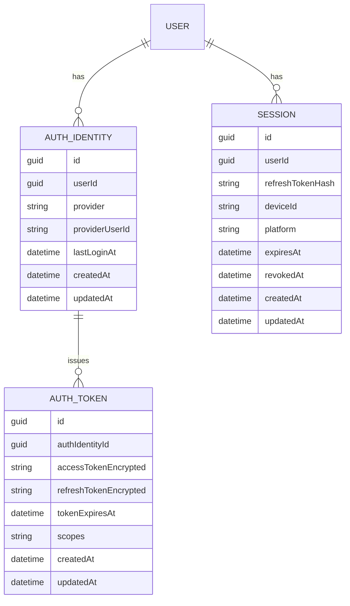

# Stays Domain Entities

This document defines the core domain entities for Stays, their relationships, and important invariants.

## Core Entities

### User
Represents a person using Stays.

Fields:
- id
- email
- emailVerified
- displayName
- avatarUrl
- homeLocation
- visibleToPublic
- createdAt
- updatedAt

### UserCredential
Authentication data for a user. Passwords must never be stored in plain text.

Fields:
- userId
- passwordHash
- passwordSalt (optional, depending on hashing scheme)
- passwordAlgorithm
- passwordUpdatedAt
- failedLoginCount
- lockedUntil
- createdAt
- updatedAt

### EmailVerification
Used to verify user email address

Fields:
- userId
- verificationTokenHash
- expiresAt
- createdAt
- updatedAt

### Family
Represents a household or shared group that users can belong to.

Fields:
- id
- name
- createdByUserId
- visibleToPublic
- createdAt
- updatedAt

### FamilyMember
Join entity representing a user's membership within a family.

Fields:
- familyId
- userId
- role (owner, adult, member, child)
- joinedAt
- status (active, invited, removed)
- createdAt
- updatedAt

### Place
Represents a physical location where a user stayed or visited.

Fields:
- id
- name
- category (lodging, restaurant, park, landmark, other)
- address
- latitude
- longitude
- externalProviderRef
- createdAt
- updatedAt

### Visit
Primary aggregate root representing a user memory at a place and time.

Fields:
- id
- userId
- placeId
- title
- startedAt
- endedAt
- rating (optional)
- privacy (private, shared, public)
- createdAt
- updatedAt

### Note
Text content attached to a visit.

Fields:
- id
- visitId
- authorUserId
- content
- createdAt
- updatedAt

### Photo
Media content attached to a visit.

Fields:
- id
- visitId
- ownerUserId
- storageKey
- capturedAt
- latitude
- longitude
- caption
- createdAt
- updatedAt

### Tag
User-defined label for organizing visits.

Fields:
- id
- userId
- name
- color
- createdAt
- updatedAt

### VisitTag
Join entity linking visits and tags.

Fields:
- visitId
- tagId
- createdAt
- updatedAt

## Planned Entities (Phase 2)

### AuthIdentity
External auth methods (facebook, google, linkedin, twitter, etc)

Fields:
- id
- userId
- provider
- providerUserId
- lastLoginAt
- createdAt
- updatedAt

### AuthToken
External auth provider tokens for access and refresh

Fields:
- id
- authIdentityId
- accessTokenEncrypted
- refreshTokenEncrypted
- tokenExpiresAt
- scopes
- createdAt
- updatedAt

### Session
Represents Web + Mobile refresh token

Fields:
- id
- userId
- refreshTokenHash
- deviceId
- platform
- expiresAt
- revokedAt
- createdAt
- updatedAt

### Trip
Groups multiple visits into a single journey.

Fields:
- id
- userId
- name
- startDate
- endDate
- coverPhotoId
- createdAt
- updatedAt

### TripVisit
Ordered join entity between trips and visits.

Fields:
- tripId
- visitId
- startDate
- endDate
- sortOrder
- createdAt
- updatedAt

## Relationships

- User 1:1 UserCredential
- User N:M Family (through FamilyMember)
- User 1:N Visit
- Place 1:N Visit
- Visit 1:N Note
- Visit 1:N Photo
- Visit N:M Tag (through VisitTag)
- Trip N:M Visit (through TripVisit)

## Invariants

- A Family must have at least one active owner.
- A User can belong to many Families.
- A User can have at most one active membership record per Family.
- A Visit must belong to exactly one User.
- Family membership does not change Visit ownership; Visits remain owned by a single User unless explicit sharing is added later.
- A User may have at most one local UserCredential record.
- Passwords must be stored as hashes, not plain text.
- A salt alone is not sufficient for authentication; the system must store a verifiable password hash.
- A Note cannot exist without a Visit.
- A Photo cannot exist without a Visit.
- Only the owner of a Visit can edit Visit content (until collaboration is introduced).
- endedAt must be greater than or equal to startedAt.
- Tag names must be unique per User.

## Suggested Bounded Contexts

- Identity and Access: user profile, authentication, authorization, privacy defaults
- Family and Membership: family lifecycle, invitations, roles, membership policies
- Stay Journal: visit, note, photo, tag, trip management
- Places and Geography: place normalization, geocoding metadata
- Media: upload, processing, and storage lifecycle

## Entity Relationship Diagram

